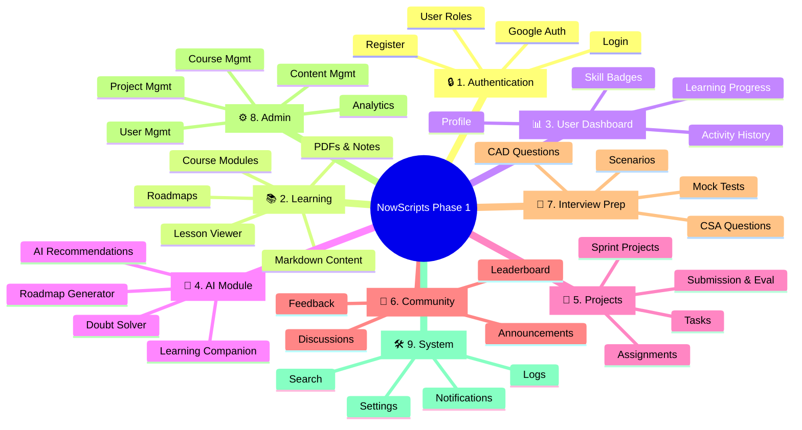

# NowScripts Software Architecture (Phase 1)

This document outlines the **modular software architecture** for NowScripts Phase 1. By structuring the platform into distinct, decoupled modules, we ensure high scalability and simplify task allocation across distributed teams of contributors.

---

## 1. Modular Breakdown (Phase 1)

The platform is divided into **9 independent modules**. This structure isolates domains, making it easier to assign each module to different contributors while keeping the system scalable for future freelance phases.

---

## 2. Contributor Allocation

Mapping the 9 modules to specific engineering and content roles to parallelize development.

| Module | Primary Role | Secondary Role |
| :--- | :--- | :--- |
| **Authentication** | Full Stack Developer | Security Engineer |
| **Learning** | ServiceNow Developer | Content Creator |
| **Dashboard** | Frontend Developer | UI/UX Designer |
| **AI** | AI/ML Engineer | Backend Developer |
| **Projects** | ServiceNow Developer | Content Creator |
| **Community** | Full Stack Developer | Community Manager |
| **Interview Prep**| Content Creator | ServiceNow Architect |
| **Admin** | Full Stack Developer | Data Analyst |
| **System Services**| Backend Developer | DevOps Engineer |

---

## 3. Technology Allocation

The technology stack supporting Phase 1, categorized by domain.

---

## 4. Phase 1 Component Architecture

The flow of data and interaction between the core system components. 
<svg xmlns="http://www.w3.org/2000/svg" viewBox="0 0 576.182 928.3419999999999" width="576.182" height="928.3419999999999" style="--bg:#1F1F1F;--fg:#CCCCCC;--line:#CCCCCC;--accent:#0078D4;--muted:#CCCCCCCC;--surface:#181818;--border:#CCCCCC;background:var(--bg)">

<defs>
  <marker id="arrowhead" markerWidth="8" markerHeight="5" refX="7" refY="2.5" orient="auto">
    <polygon points="0 0, 8 2.5, 0 5" fill="var(--_arrow)" stroke="var(--_arrow)" stroke-width="0.75" stroke-linejoin="round" />
  </marker>
  <marker id="arrowhead-start" markerWidth="8" markerHeight="5" refX="1" refY="2.5" orient="auto-start-reverse">
    <polygon points="8 0, 0 2.5, 8 5" fill="var(--_arrow)" stroke="var(--_arrow)" stroke-width="0.75" stroke-linejoin="round" />
  </marker>
</defs>
<polyline class="edge" data-from="Client" data-to="Auth" data-style="solid" data-arrow-start="false" data-arrow-end="true" points="343.3695,168 343.3695,216" fill="none" stroke="var(--_line)" stroke-width="1" marker-end="url(#arrowhead)" />
<polyline class="edge" data-from="Auth" data-to="Dash" data-style="solid" data-arrow-start="false" data-arrow-end="true" points="343.3695,364.942 343.3695,412.942" fill="none" stroke="var(--_line)" stroke-width="1" marker-end="url(#arrowhead)" />
<polyline class="edge" data-from="Dash" data-to="Learn" data-style="solid" data-arrow-start="false" data-arrow-end="true" points="343.36949999999996,449.842 343.36949999999996,467.842 183.38799999999998,467.842 183.38799999999998,485.842" fill="none" stroke="var(--_line)" stroke-width="1" marker-end="url(#arrowhead)" />
<polyline class="edge" data-from="Dash" data-to="AI" data-style="solid" data-arrow-start="false" data-arrow-end="true" points="343.36949999999996,449.842 343.36949999999996,467.842 343.36949999999996,467.842 343.36949999999996,485.842" fill="none" stroke="var(--_line)" stroke-width="1" marker-end="url(#arrowhead)" />
<polyline class="edge" data-from="Dash" data-to="Comm" data-style="solid" data-arrow-start="false" data-arrow-end="true" points="343.36949999999996,449.842 343.36949999999996,467.842 484.08500000000004,467.842 484.08500000000004,485.842" fill="none" stroke="var(--_line)" stroke-width="1" marker-end="url(#arrowhead)" />
<polyline class="edge" data-from="Learn" data-to="Proj" data-style="solid" data-arrow-start="false" data-arrow-end="true" points="183.38799999999998,522.742 183.38799999999998,552.742 105.06450000000001,552.742 105.06450000000001,582.742" fill="none" stroke="var(--_line)" stroke-width="1" marker-end="url(#arrowhead)" />
<polyline class="edge" data-from="Learn" data-to="Prep" data-style="solid" data-arrow-start="false" data-arrow-end="true" points="183.38799999999998,522.742 183.38799999999998,552.742 261.7115,552.742 261.7115,582.742" fill="none" stroke="var(--_line)" stroke-width="1" marker-end="url(#arrowhead)" />
<polyline class="edge" data-from="Proj" data-to="Prog" data-style="solid" data-arrow-start="false" data-arrow-end="true" points="105.06450000000001,619.6419999999999 105.06450000000001,643.6419999999999 183.388,643.6419999999999 183.388,667.6419999999999" fill="none" stroke="var(--_line)" stroke-width="1" marker-end="url(#arrowhead)" />
<polyline class="edge" data-from="Prep" data-to="Prog" data-style="solid" data-arrow-start="false" data-arrow-end="true" points="261.7115,619.6419999999999 261.7115,643.6419999999999 183.388,643.6419999999999 183.388,667.6419999999999" fill="none" stroke="var(--_line)" stroke-width="1" marker-end="url(#arrowhead)" />
<polyline class="edge" data-from="Prog" data-to="Admin" data-style="solid" data-arrow-start="false" data-arrow-end="true" points="183.388,704.5419999999999 183.38800000000003,752.5419999999999" fill="none" stroke="var(--_line)" stroke-width="1" marker-end="url(#arrowhead)" />
<polyline class="edge" data-from="Admin" data-to="DB" data-style="solid" data-arrow-start="false" data-arrow-end="true" points="183.38800000000003,789.4419999999999 183.38799999999998,837.4419999999999" fill="none" stroke="var(--_line)" stroke-width="1" marker-end="url(#arrowhead)" />
<g class="node" data-id="Client" data-label="Client: React" data-shape="circle">
  <circle cx="343.3695" cy="104" r="64" fill="#f8fafc" stroke="#3b82f6" stroke-width="2px" />
  <text x="343.3695" y="104" text-anchor="middle" font-size="13" font-weight="500" fill="#0f172a" dy="4.55">Client: React</text>
</g>
<g class="node" data-id="Auth" data-label="Authentication" data-shape="diamond">
  <polygon points="343.3695,216 417.8405,290.471 343.3695,364.942 268.8985,290.471" fill="#eff6ff" stroke="#2563eb" stroke-width="2px" />
  <text x="343.3695" y="290.471" text-anchor="middle" font-size="13" font-weight="500" fill="var(--_text)" dy="4.55">Authentication</text>
</g>
<g class="node" data-id="Dash" data-label="Dashboard" data-shape="rectangle">
  <rect x="289.04949999999997" y="412.942" width="108.64" height="36.900000000000006" rx="0" ry="0" fill="#f1f5f9" stroke="#64748b" stroke-width="2px" />
  <text x="343.36949999999996" y="431.392" text-anchor="middle" font-size="13" font-weight="500" fill="var(--_text)" dy="4.55">Dashboard</text>
</g>
<g class="node" data-id="Learn" data-label="Learning Module" data-shape="rectangle">
  <rect x="112.02499999999998" y="485.842" width="142.726" height="36.900000000000006" rx="0" ry="0" fill="#fdf4ff" stroke="#d946ef" stroke-width="2px" />
  <text x="183.38799999999998" y="504.292" text-anchor="middle" font-size="13" font-weight="500" fill="var(--_text)" dy="4.55">Learning Module</text>
</g>
<g class="node" data-id="AI" data-label="AI Companion" data-shape="rectangle">
  <rect x="282.751" y="485.842" width="121.23700000000001" height="36.900000000000006" rx="0" ry="0" fill="#fdf4ff" stroke="#d946ef" stroke-width="2px" />
  <text x="343.36949999999996" y="504.292" text-anchor="middle" font-size="13" font-weight="500" fill="var(--_text)" dy="4.55">AI Companion</text>
</g>
<g class="node" data-id="Comm" data-label="Community" data-shape="rectangle">
  <rect x="431.988" y="485.842" width="104.19400000000002" height="36.900000000000006" rx="0" ry="0" fill="#fdf4ff" stroke="#d946ef" stroke-width="2px" />
  <text x="484.08500000000004" y="504.292" text-anchor="middle" font-size="13" font-weight="500" fill="var(--_text)" dy="4.55">Community</text>
</g>
<g class="node" data-id="Proj" data-label="Sprint Projects" data-shape="rectangle">
  <rect x="40" y="582.742" width="130.12900000000002" height="36.900000000000006" rx="0" ry="0" fill="#fff1f2" stroke="#f43f5e" stroke-width="2px" />
  <text x="105.06450000000001" y="601.192" text-anchor="middle" font-size="13" font-weight="500" fill="var(--_text)" dy="4.55">Sprint Projects</text>
</g>
<g class="node" data-id="Prep" data-label="Interview Prep" data-shape="rectangle">
  <rect x="198.12900000000002" y="582.742" width="127.16499999999999" height="36.900000000000006" rx="0" ry="0" fill="#fff1f2" stroke="#f43f5e" stroke-width="2px" />
  <text x="261.7115" y="601.192" text-anchor="middle" font-size="13" font-weight="500" fill="var(--_text)" dy="4.55">Interview Prep</text>
</g>
<g class="node" data-id="Prog" data-label="Progress &amp; Badges" data-shape="rectangle">
  <rect x="104.61500000000001" y="667.6419999999999" width="157.546" height="36.900000000000006" rx="0" ry="0" fill="#ecfeff" stroke="#06b6d4" stroke-width="2px" />
  <text x="183.388" y="686.092" text-anchor="middle" font-size="13" font-weight="500" fill="var(--_text)" dy="4.55">Progress &amp; Badges</text>
</g>
<g class="node" data-id="Admin" data-label="Admin Panel" data-shape="rectangle">
  <rect x="126.47450000000002" y="752.5419999999999" width="113.827" height="36.900000000000006" rx="0" ry="0" fill="#fffbeb" stroke="#d97706" stroke-width="2px" />
  <text x="183.38800000000003" y="770.992" text-anchor="middle" font-size="13" font-weight="500" fill="var(--_text)" dy="4.55">Admin Panel</text>
</g>
<g class="node" data-id="DB" data-label="MongoDB + AI APIs" data-shape="cylinder">
  <rect x="106.097" y="844.4419999999999" width="154.582" height="36.900000000000006" fill="#f0fdf4" stroke="none" />
  <line x1="106.097" y1="844.4419999999999" x2="106.097" y2="881.3419999999999" stroke="#22c55e" stroke-width="2px" />
  <line x1="260.679" y1="844.4419999999999" x2="260.679" y2="881.3419999999999" stroke="#22c55e" stroke-width="2px" />
  <ellipse cx="183.38799999999998" cy="881.3419999999999" rx="77.291" ry="7" fill="#f0fdf4" stroke="#22c55e" stroke-width="2px" />
  <ellipse cx="183.38799999999998" cy="844.4419999999999" rx="77.291" ry="7" fill="#f0fdf4" stroke="#22c55e" stroke-width="2px" />
  <text x="183.38799999999998" y="862.8919999999999" text-anchor="middle" font-size="13" font-weight="500" fill="var(--_text)" dy="4.55">MongoDB + AI APIs</text>
</g>
</svg>

> [!NOTE]
> This architecture ensures that as the platform matures from an EdTech learning hub into a dual-sided Freelance marketplace, the core micro-frontends and backend services remain completely decoupled and easily extensible.
