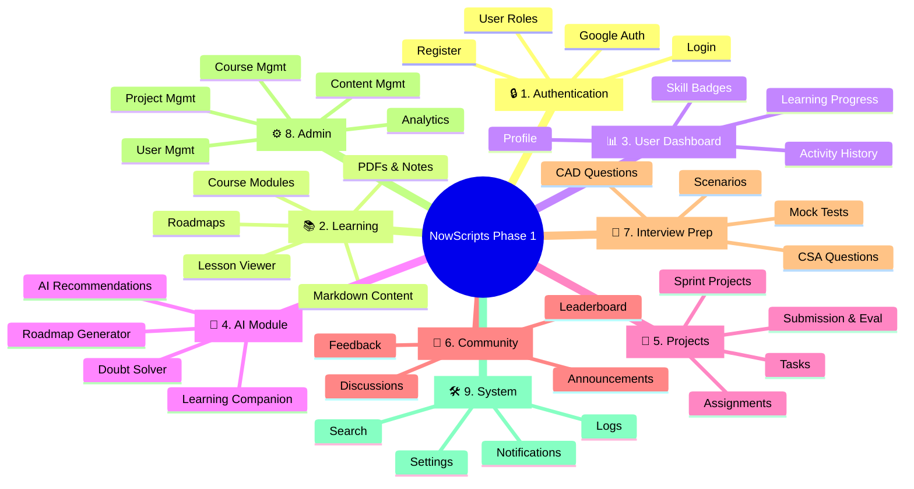
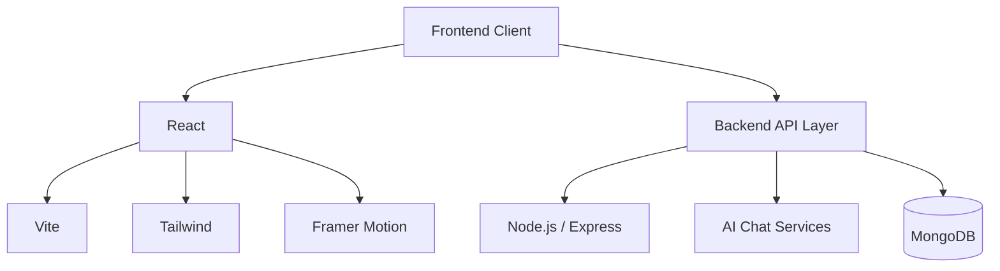
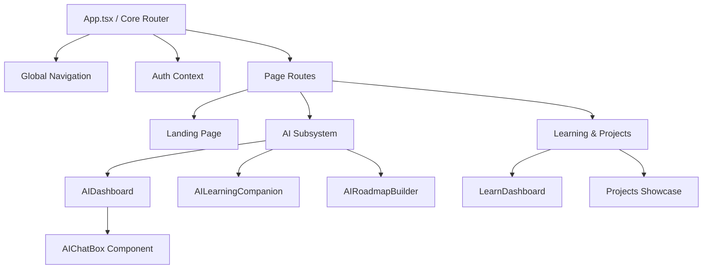

# NowScripts Software Architecture (Phase 1)

This document outlines the **modular software architecture** for NowScripts Phase 1. By structuring the platform into distinct, decoupled modules, we ensure high scalability and simplify task allocation across distributed teams of contributors.

---

## 1. Modular Breakdown (Phase 1)

The platform is divided into **9 independent modules**. This structure isolates domains, making it easier to assign each module to different contributors while keeping the system scalable for future freelance phases.

---

## 2. Contributor Allocation

Mapping the 9 modules to specific engineering and content roles to parallelize development.

| Module | Primary Role | Secondary Role |
| :--- | :--- | :--- |
| **Authentication** | Full Stack Developer | Security Engineer |
| **Learning** | ServiceNow Developer | Content Creator |
| **Dashboard** | Frontend Developer | UI/UX Designer |
| **AI** | AI/ML Engineer | Backend Developer |
| **Projects** | ServiceNow Developer | Content Creator |
| **Community** | Full Stack Developer | Community Manager |
| **Interview Prep**| Content Creator | ServiceNow Architect |
| **Admin** | Full Stack Developer | Data Analyst |
| **System Services**| Backend Developer | DevOps Engineer |

---

## 3. Technology Allocation

The technology stack supporting Phase 1, specifically for the frontend architecture.

* **Core Framework**: React 18 with TypeScript.
* **Build Tool**: Vite (for optimized builds and fast Hot Module Replacement).
* **Styling**: Tailwind CSS for utility-first responsive styling.
* **Routing**: React Router DOM (v6) for client-side routing.
* **Icons**: Lucide React for consistent SVG icons.
* **Animations**: Framer Motion for scroll-linked animations and UI transitions.
* **State Management**: React Context API (`AuthContext`, `AppContext`).
* **Markdown rendering**: React-Markdown combined with Remark-GFM for rendering AI responses.

---

## 4. Phase 1 Component Architecture

The flow of data and interaction between the core frontend components. 

The application is split into distinct domains to ensure reusability and isolation:

1. **Global Layout**: `App.tsx` wraps the router and provides context. `LandingNavbar.tsx` and `AvatarMenu.tsx` handle global navigation.
2. **Landing Page**: Built from modular components in `/components/landing` (e.g., `PremiumHero`, `TestimonialsV2`).
3. **AI Module (`/ai/*`)**: Isolated subsystem. Uses `AIDashboard` as the hub, with `AIChatBox` for the chat interface and the `useAI` hook for managing chat sessions and state.
4. **Learning & Projects**: Domain-specific pages like `LearnDashboard.tsx` and `Projects.tsx`.

> [!NOTE]
> This architecture ensures that as the platform matures from an EdTech learning hub into a dual-sided Freelance marketplace, the core micro-frontends and backend services remain completely decoupled and easily extensible.
