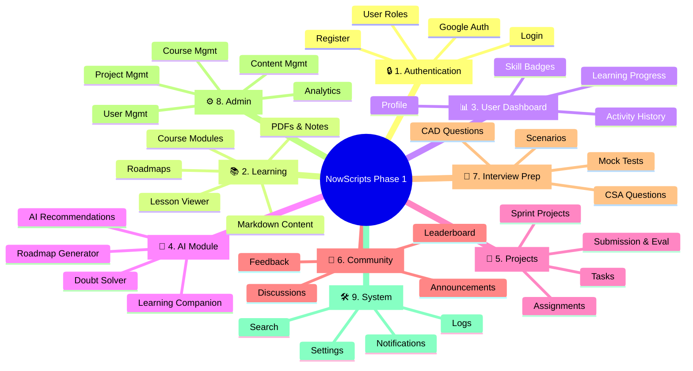

# NowScripts Software Architecture (Phase 1)

This document outlines the **modular software architecture** for NowScripts Phase 1. By structuring the platform into distinct, decoupled modules, we ensure high scalability and simplify task allocation across distributed teams of contributors.

---

## 1. Modular Breakdown (Phase 1)

The platform is divided into **9 independent modules**. This structure isolates domains, making it easier to assign each module to different contributors while keeping the system scalable for future freelance phases.

---

## 2. Contributor Allocation

Mapping the 9 modules to specific engineering and content roles to parallelize development.

| Module | Primary Role | Secondary Role |
| :--- | :--- | :--- |
| **Authentication** | Full Stack Developer | Security Engineer |
| **Learning** | ServiceNow Developer | Content Creator |
| **Dashboard** | Frontend Developer | UI/UX Designer |
| **AI** | AI/ML Engineer | Backend Developer |
| **Projects** | ServiceNow Developer | Content Creator |
| **Community** | Full Stack Developer | Community Manager |
| **Interview Prep**| Content Creator | ServiceNow Architect |
| **Admin** | Full Stack Developer | Data Analyst |
| **System Services**| Backend Developer | DevOps Engineer |

---

## 3. Technology Allocation

The technology stack supporting Phase 1, categorized by domain.
<svg xmlns="http://www.w3.org/2000/svg" viewBox="0 0 645.344 640.3000000000001" width="645.344" height="640.3000000000001" style="--bg:#1F1F1F;--fg:#CCCCCC;--line:#CCCCCC;--accent:#0078D4;--muted:#CCCCCCCC;--surface:#181818;--border:#CCCCCC;background:var(--bg)">

<defs>
  <marker id="arrowhead" markerWidth="8" markerHeight="5" refX="7" refY="2.5" orient="auto">
    <polygon points="0 0, 8 2.5, 0 5" fill="var(--_arrow)" stroke="var(--_arrow)" stroke-width="0.75" stroke-linejoin="round" />
  </marker>
  <marker id="arrowhead-start" markerWidth="8" markerHeight="5" refX="1" refY="2.5" orient="auto-start-reverse">
    <polygon points="8 0, 0 2.5, 8 5" fill="var(--_arrow)" stroke="var(--_arrow)" stroke-width="0.75" stroke-linejoin="round" />
  </marker>
</defs>
<g class="subgraph" data-id="Frontend" data-label="Frontend">
  <rect x="40" y="154.62500000000003" width="159.906" height="356.5" rx="0" ry="0" fill="var(--_group-fill)" stroke="var(--_node-stroke)" stroke-width="1" />
  <rect x="40" y="154.62500000000003" width="159.906" height="28" rx="0" ry="0" fill="var(--_group-hdr)" stroke="var(--_node-stroke)" stroke-width="1" />
  <text x="52" y="168.62500000000003" font-size="12" font-weight="600" fill="var(--_text-sec)" dy="4.199999999999999">Frontend</text>
</g>
<g class="subgraph" data-id="Backend" data-label="Backend">
  <rect x="247.906" y="180.07500000000002" width="132.489" height="305.6" rx="0" ry="0" fill="var(--_group-fill)" stroke="var(--_node-stroke)" stroke-width="1" />
  <rect x="247.906" y="180.07500000000002" width="132.489" height="28" rx="0" ry="0" fill="var(--_group-hdr)" stroke="var(--_node-stroke)" stroke-width="1" />
  <text x="259.906" y="194.07500000000002" font-size="12" font-weight="600" fill="var(--_text-sec)" dy="4.199999999999999">Backend</text>
</g>
<g class="subgraph" data-id="AI" data-label="Artificial Intelligence">
  <rect x="428.3950000000001" y="40" width="176.949" height="291.6" rx="0" ry="0" fill="var(--_group-fill)" stroke="var(--_node-stroke)" stroke-width="1" />
  <rect x="428.3950000000001" y="40" width="176.949" height="28" rx="0" ry="0" fill="var(--_group-hdr)" stroke="var(--_node-stroke)" stroke-width="1" />
  <text x="440.3950000000001" y="54" font-size="12" font-weight="600" fill="var(--_text-sec)" dy="4.199999999999999">Artificial Intelligence</text>
</g>
<g class="subgraph" data-id="DevOps" data-label="DevOps &amp; Infra">
  <rect x="428.395" y="359.6" width="159.165" height="240.70000000000002" rx="0" ry="0" fill="var(--_group-fill)" stroke="var(--_node-stroke)" stroke-width="1" />
  <rect x="428.395" y="359.6" width="159.165" height="28" rx="0" ry="0" fill="var(--_group-hdr)" stroke="var(--_node-stroke)" stroke-width="1" />
  <text x="440.395" y="373.6" font-size="12" font-weight="600" fill="var(--_text-sec)" dy="4.199999999999999">DevOps &amp; Infra</text>
</g>
<polyline class="edge" data-from="Frontend" data-to="Backend" data-style="dotted" data-arrow-start="false" data-arrow-end="true" points="199.906,332.875 247.906,332.875" fill="none" stroke="var(--_line)" stroke-width="1" stroke-dasharray="4 4" marker-end="url(#arrowhead)" />
<polyline class="edge" data-from="Backend" data-to="AI" data-style="dotted" data-arrow-start="false" data-arrow-end="true" points="380.395,281.9416666666667 416.3950000000001,281.9416666666667 416.3950000000001,185.8 428.3950000000001,185.8" fill="none" stroke="var(--_line)" stroke-width="1" stroke-dasharray="4 4" marker-end="url(#arrowhead)" />
<polyline class="edge" data-from="Backend" data-to="DevOps" data-style="dotted" data-arrow-start="false" data-arrow-end="true" points="380.395,383.8083333333334 416.395,383.8083333333334 416.395,479.95000000000005 428.395,479.95000000000005" fill="none" stroke="var(--_line)" stroke-width="1" stroke-dasharray="4 4" marker-end="url(#arrowhead)" />
<g class="node" data-id="React" data-label="React" data-shape="rectangle">
  <rect x="68.9675" y="263.52500000000003" width="76.036" height="36.900000000000006" rx="0" ry="0" fill="var(--_node-fill)" stroke="var(--_node-stroke)" stroke-width="0.75" />
  <text x="106.9855" y="281.975" text-anchor="middle" font-size="13" font-weight="500" fill="var(--_text)" dy="4.55">React</text>
</g>
<g class="node" data-id="TS" data-label="TypeScript" data-shape="rectangle">
  <rect x="68.9675" y="328.42500000000007" width="108.64000000000001" height="36.900000000000006" rx="0" ry="0" fill="var(--_node-fill)" stroke="var(--_node-stroke)" stroke-width="0.75" />
  <text x="123.28750000000001" y="346.87500000000006" text-anchor="middle" font-size="13" font-weight="500" fill="var(--_text)" dy="4.55">TypeScript</text>
</g>
<g class="node" data-id="TW" data-label="Tailwind CSS" data-shape="rectangle">
  <rect x="68.9675" y="198.62500000000003" width="119.75499999999998" height="36.900000000000006" rx="0" ry="0" fill="var(--_node-fill)" stroke="var(--_node-stroke)" stroke-width="0.75" />
  <text x="128.845" y="217.07500000000005" text-anchor="middle" font-size="13" font-weight="500" fill="var(--_text)" dy="4.55">Tailwind CSS</text>
</g>
<g class="node" data-id="UI" data-label="ShadCN UI" data-shape="rectangle">
  <rect x="68.9675" y="393.32500000000005" width="104.93499999999999" height="36.900000000000006" rx="0" ry="0" fill="var(--_node-fill)" stroke="var(--_node-stroke)" stroke-width="0.75" />
  <text x="121.435" y="411.77500000000003" text-anchor="middle" font-size="13" font-weight="500" fill="var(--_text)" dy="4.55">ShadCN UI</text>
</g>
<g class="node" data-id="FM" data-label="Framer Motion" data-shape="rectangle">
  <rect x="68.9675" y="458.225" width="127.906" height="36.900000000000006" rx="0" ry="0" fill="var(--_node-fill)" stroke="var(--_node-stroke)" stroke-width="0.75" />
  <text x="132.9205" y="476.675" text-anchor="middle" font-size="13" font-weight="500" fill="var(--_text)" dy="4.55">Framer Motion</text>
</g>
<g class="node" data-id="Node" data-label="Node.js" data-shape="rectangle">
  <rect x="267.42575" y="302.975" width="86.41" height="36.900000000000006" rx="0" ry="0" fill="var(--_node-fill)" stroke="var(--_node-stroke)" stroke-width="0.75" />
  <text x="310.63075" y="321.425" text-anchor="middle" font-size="13" font-weight="500" fill="var(--_text)" dy="4.55">Node.js</text>
</g>
<g class="node" data-id="Exp" data-label="Express" data-shape="rectangle">
  <rect x="267.2405" y="367.875" width="93.82" height="36.900000000000006" rx="0" ry="0" fill="var(--_node-fill)" stroke="var(--_node-stroke)" stroke-width="0.75" />
  <text x="314.15049999999997" y="386.325" text-anchor="middle" font-size="13" font-weight="500" fill="var(--_text)" dy="4.55">Express</text>
</g>
<g class="node" data-id="DB" data-label="MongoDB" data-shape="cylinder">
  <rect x="267.42575" y="231.07500000000002" width="100.489" height="36.900000000000006" fill="var(--_node-fill)" stroke="none" />
  <line x1="267.42575" y1="231.07500000000002" x2="267.42575" y2="267.975" stroke="var(--_node-stroke)" stroke-width="0.75" />
  <line x1="367.91475" y1="231.07500000000002" x2="367.91475" y2="267.975" stroke="var(--_node-stroke)" stroke-width="0.75" />
  <ellipse cx="317.67025" cy="267.975" rx="50.2445" ry="7" fill="var(--_node-fill)" stroke="var(--_node-stroke)" stroke-width="0.75" />
  <ellipse cx="317.67025" cy="231.07500000000002" rx="50.2445" ry="7" fill="var(--_node-fill)" stroke="var(--_node-stroke)" stroke-width="0.75" />
  <text x="317.67025" y="249.52500000000003" text-anchor="middle" font-size="13" font-weight="500" fill="var(--_text)" dy="4.55">MongoDB</text>
</g>
<g class="node" data-id="JWT" data-label="JWT Auth" data-shape="rectangle">
  <rect x="267.42575" y="432.77500000000003" width="99.748" height="36.900000000000006" rx="0" ry="0" fill="var(--_node-fill)" stroke="var(--_node-stroke)" stroke-width="0.75" />
  <text x="317.29975" y="451.225" text-anchor="middle" font-size="13" font-weight="500" fill="var(--_text)" dy="4.55">JWT Auth</text>
</g>
<g class="node" data-id="Sarvam" data-label="Sarvam APIs" data-shape="rectangle">
  <rect x="457.7330000000001" y="148.9" width="118.273" height="36.900000000000006" rx="0" ry="0" fill="var(--_node-fill)" stroke="var(--_node-stroke)" stroke-width="0.75" />
  <text x="516.8695000000001" y="167.35000000000002" text-anchor="middle" font-size="13" font-weight="500" fill="var(--_text)" dy="4.55">Sarvam APIs</text>
</g>
<g class="node" data-id="LLM" data-label="OpenAI / LLMs" data-shape="rectangle">
  <rect x="458.10350000000005" y="213.8" width="129.38799999999998" height="36.900000000000006" rx="0" ry="0" fill="var(--_node-fill)" stroke="var(--_node-stroke)" stroke-width="0.75" />
  <text x="522.7975" y="232.25" text-anchor="middle" font-size="13" font-weight="500" fill="var(--_text)" dy="4.55">OpenAI / LLMs</text>
</g>
<g class="node" data-id="RAG" data-label="RAG Architecture" data-shape="rectangle">
  <rect x="458.10350000000005" y="84" width="144.949" height="36.900000000000006" rx="0" ry="0" fill="var(--_node-fill)" stroke="var(--_node-stroke)" stroke-width="0.75" />
  <text x="530.5780000000001" y="102.45" text-anchor="middle" font-size="13" font-weight="500" fill="var(--_text)" dy="4.55">RAG Architecture</text>
</g>
<g class="node" data-id="Voice" data-label="Voice AI" data-shape="rectangle">
  <rect x="458.10350000000005" y="278.70000000000005" width="90.11500000000001" height="36.900000000000006" rx="0" ry="0" fill="var(--_node-fill)" stroke="var(--_node-stroke)" stroke-width="0.75" />
  <text x="503.16100000000006" y="297.15000000000003" text-anchor="middle" font-size="13" font-weight="500" fill="var(--_text)" dy="4.55">Voice AI</text>
</g>
<g class="node" data-id="Render" data-label="Render Cloud" data-shape="rectangle">
  <rect x="458.10350000000005" y="482.5" width="122.71900000000001" height="36.900000000000006" rx="0" ry="0" fill="var(--_node-fill)" stroke="var(--_node-stroke)" stroke-width="0.75" />
  <text x="519.4630000000001" y="500.95" text-anchor="middle" font-size="13" font-weight="500" fill="var(--_text)" dy="4.55">Render Cloud</text>
</g>
<g class="node" data-id="CICD" data-label="GitHub Actions" data-shape="rectangle">
  <rect x="458.10350000000005" y="547.4000000000001" width="127.16499999999999" height="36.900000000000006" rx="0" ry="0" fill="var(--_node-fill)" stroke="var(--_node-stroke)" stroke-width="0.75" />
  <text x="521.686" y="565.8500000000001" text-anchor="middle" font-size="13" font-weight="500" fill="var(--_text)" dy="4.55">GitHub Actions</text>
</g>
<g class="node" data-id="Storage" data-label="Cloud Storage" data-shape="cylinder">
  <rect x="458.10350000000005" y="410.6" width="125.68299999999999" height="36.900000000000006" fill="var(--_node-fill)" stroke="none" />
  <line x1="458.10350000000005" y1="410.6" x2="458.10350000000005" y2="447.5" stroke="var(--_node-stroke)" stroke-width="0.75" />
  <line x1="583.7865" y1="410.6" x2="583.7865" y2="447.5" stroke="var(--_node-stroke)" stroke-width="0.75" />
  <ellipse cx="520.945" cy="447.5" rx="62.841499999999996" ry="7" fill="var(--_node-fill)" stroke="var(--_node-stroke)" stroke-width="0.75" />
  <ellipse cx="520.945" cy="410.6" rx="62.841499999999996" ry="7" fill="var(--_node-fill)" stroke="var(--_node-stroke)" stroke-width="0.75" />
  <text x="520.945" y="429.05" text-anchor="middle" font-size="13" font-weight="500" fill="var(--_text)" dy="4.55">Cloud Storage</text>
</g>
</svg>

---

## 4. Phase 1 Component Architecture

The flow of data and interaction between the core system components. 
<svg xmlns="http://www.w3.org/2000/svg" viewBox="0 0 576.182 928.3419999999999" width="576.182" height="928.3419999999999" style="--bg:#1F1F1F;--fg:#CCCCCC;--line:#CCCCCC;--accent:#0078D4;--muted:#CCCCCCCC;--surface:#181818;--border:#CCCCCC;background:var(--bg)">

<defs>
  <marker id="arrowhead" markerWidth="8" markerHeight="5" refX="7" refY="2.5" orient="auto">
    <polygon points="0 0, 8 2.5, 0 5" fill="var(--_arrow)" stroke="var(--_arrow)" stroke-width="0.75" stroke-linejoin="round" />
  </marker>
  <marker id="arrowhead-start" markerWidth="8" markerHeight="5" refX="1" refY="2.5" orient="auto-start-reverse">
    <polygon points="8 0, 0 2.5, 8 5" fill="var(--_arrow)" stroke="var(--_arrow)" stroke-width="0.75" stroke-linejoin="round" />
  </marker>
</defs>
<polyline class="edge" data-from="Client" data-to="Auth" data-style="solid" data-arrow-start="false" data-arrow-end="true" points="343.3695,168 343.3695,216" fill="none" stroke="var(--_line)" stroke-width="1" marker-end="url(#arrowhead)" />
<polyline class="edge" data-from="Auth" data-to="Dash" data-style="solid" data-arrow-start="false" data-arrow-end="true" points="343.3695,364.942 343.3695,412.942" fill="none" stroke="var(--_line)" stroke-width="1" marker-end="url(#arrowhead)" />
<polyline class="edge" data-from="Dash" data-to="Learn" data-style="solid" data-arrow-start="false" data-arrow-end="true" points="343.36949999999996,449.842 343.36949999999996,467.842 183.38799999999998,467.842 183.38799999999998,485.842" fill="none" stroke="var(--_line)" stroke-width="1" marker-end="url(#arrowhead)" />
<polyline class="edge" data-from="Dash" data-to="AI" data-style="solid" data-arrow-start="false" data-arrow-end="true" points="343.36949999999996,449.842 343.36949999999996,467.842 343.36949999999996,467.842 343.36949999999996,485.842" fill="none" stroke="var(--_line)" stroke-width="1" marker-end="url(#arrowhead)" />
<polyline class="edge" data-from="Dash" data-to="Comm" data-style="solid" data-arrow-start="false" data-arrow-end="true" points="343.36949999999996,449.842 343.36949999999996,467.842 484.08500000000004,467.842 484.08500000000004,485.842" fill="none" stroke="var(--_line)" stroke-width="1" marker-end="url(#arrowhead)" />
<polyline class="edge" data-from="Learn" data-to="Proj" data-style="solid" data-arrow-start="false" data-arrow-end="true" points="183.38799999999998,522.742 183.38799999999998,552.742 105.06450000000001,552.742 105.06450000000001,582.742" fill="none" stroke="var(--_line)" stroke-width="1" marker-end="url(#arrowhead)" />
<polyline class="edge" data-from="Learn" data-to="Prep" data-style="solid" data-arrow-start="false" data-arrow-end="true" points="183.38799999999998,522.742 183.38799999999998,552.742 261.7115,552.742 261.7115,582.742" fill="none" stroke="var(--_line)" stroke-width="1" marker-end="url(#arrowhead)" />
<polyline class="edge" data-from="Proj" data-to="Prog" data-style="solid" data-arrow-start="false" data-arrow-end="true" points="105.06450000000001,619.6419999999999 105.06450000000001,643.6419999999999 183.388,643.6419999999999 183.388,667.6419999999999" fill="none" stroke="var(--_line)" stroke-width="1" marker-end="url(#arrowhead)" />
<polyline class="edge" data-from="Prep" data-to="Prog" data-style="solid" data-arrow-start="false" data-arrow-end="true" points="261.7115,619.6419999999999 261.7115,643.6419999999999 183.388,643.6419999999999 183.388,667.6419999999999" fill="none" stroke="var(--_line)" stroke-width="1" marker-end="url(#arrowhead)" />
<polyline class="edge" data-from="Prog" data-to="Admin" data-style="solid" data-arrow-start="false" data-arrow-end="true" points="183.388,704.5419999999999 183.38800000000003,752.5419999999999" fill="none" stroke="var(--_line)" stroke-width="1" marker-end="url(#arrowhead)" />
<polyline class="edge" data-from="Admin" data-to="DB" data-style="solid" data-arrow-start="false" data-arrow-end="true" points="183.38800000000003,789.4419999999999 183.38799999999998,837.4419999999999" fill="none" stroke="var(--_line)" stroke-width="1" marker-end="url(#arrowhead)" />
<g class="node" data-id="Client" data-label="Client: React" data-shape="circle">
  <circle cx="343.3695" cy="104" r="64" fill="#f8fafc" stroke="#3b82f6" stroke-width="2px" />
  <text x="343.3695" y="104" text-anchor="middle" font-size="13" font-weight="500" fill="#0f172a" dy="4.55">Client: React</text>
</g>
<g class="node" data-id="Auth" data-label="Authentication" data-shape="diamond">
  <polygon points="343.3695,216 417.8405,290.471 343.3695,364.942 268.8985,290.471" fill="#eff6ff" stroke="#2563eb" stroke-width="2px" />
  <text x="343.3695" y="290.471" text-anchor="middle" font-size="13" font-weight="500" fill="var(--_text)" dy="4.55">Authentication</text>
</g>
<g class="node" data-id="Dash" data-label="Dashboard" data-shape="rectangle">
  <rect x="289.04949999999997" y="412.942" width="108.64" height="36.900000000000006" rx="0" ry="0" fill="#f1f5f9" stroke="#64748b" stroke-width="2px" />
  <text x="343.36949999999996" y="431.392" text-anchor="middle" font-size="13" font-weight="500" fill="var(--_text)" dy="4.55">Dashboard</text>
</g>
<g class="node" data-id="Learn" data-label="Learning Module" data-shape="rectangle">
  <rect x="112.02499999999998" y="485.842" width="142.726" height="36.900000000000006" rx="0" ry="0" fill="#fdf4ff" stroke="#d946ef" stroke-width="2px" />
  <text x="183.38799999999998" y="504.292" text-anchor="middle" font-size="13" font-weight="500" fill="var(--_text)" dy="4.55">Learning Module</text>
</g>
<g class="node" data-id="AI" data-label="AI Companion" data-shape="rectangle">
  <rect x="282.751" y="485.842" width="121.23700000000001" height="36.900000000000006" rx="0" ry="0" fill="#fdf4ff" stroke="#d946ef" stroke-width="2px" />
  <text x="343.36949999999996" y="504.292" text-anchor="middle" font-size="13" font-weight="500" fill="var(--_text)" dy="4.55">AI Companion</text>
</g>
<g class="node" data-id="Comm" data-label="Community" data-shape="rectangle">
  <rect x="431.988" y="485.842" width="104.19400000000002" height="36.900000000000006" rx="0" ry="0" fill="#fdf4ff" stroke="#d946ef" stroke-width="2px" />
  <text x="484.08500000000004" y="504.292" text-anchor="middle" font-size="13" font-weight="500" fill="var(--_text)" dy="4.55">Community</text>
</g>
<g class="node" data-id="Proj" data-label="Sprint Projects" data-shape="rectangle">
  <rect x="40" y="582.742" width="130.12900000000002" height="36.900000000000006" rx="0" ry="0" fill="#fff1f2" stroke="#f43f5e" stroke-width="2px" />
  <text x="105.06450000000001" y="601.192" text-anchor="middle" font-size="13" font-weight="500" fill="var(--_text)" dy="4.55">Sprint Projects</text>
</g>
<g class="node" data-id="Prep" data-label="Interview Prep" data-shape="rectangle">
  <rect x="198.12900000000002" y="582.742" width="127.16499999999999" height="36.900000000000006" rx="0" ry="0" fill="#fff1f2" stroke="#f43f5e" stroke-width="2px" />
  <text x="261.7115" y="601.192" text-anchor="middle" font-size="13" font-weight="500" fill="var(--_text)" dy="4.55">Interview Prep</text>
</g>
<g class="node" data-id="Prog" data-label="Progress &amp; Badges" data-shape="rectangle">
  <rect x="104.61500000000001" y="667.6419999999999" width="157.546" height="36.900000000000006" rx="0" ry="0" fill="#ecfeff" stroke="#06b6d4" stroke-width="2px" />
  <text x="183.388" y="686.092" text-anchor="middle" font-size="13" font-weight="500" fill="var(--_text)" dy="4.55">Progress &amp; Badges</text>
</g>
<g class="node" data-id="Admin" data-label="Admin Panel" data-shape="rectangle">
  <rect x="126.47450000000002" y="752.5419999999999" width="113.827" height="36.900000000000006" rx="0" ry="0" fill="#fffbeb" stroke="#d97706" stroke-width="2px" />
  <text x="183.38800000000003" y="770.992" text-anchor="middle" font-size="13" font-weight="500" fill="var(--_text)" dy="4.55">Admin Panel</text>
</g>
<g class="node" data-id="DB" data-label="MongoDB + AI APIs" data-shape="cylinder">
  <rect x="106.097" y="844.4419999999999" width="154.582" height="36.900000000000006" fill="#f0fdf4" stroke="none" />
  <line x1="106.097" y1="844.4419999999999" x2="106.097" y2="881.3419999999999" stroke="#22c55e" stroke-width="2px" />
  <line x1="260.679" y1="844.4419999999999" x2="260.679" y2="881.3419999999999" stroke="#22c55e" stroke-width="2px" />
  <ellipse cx="183.38799999999998" cy="881.3419999999999" rx="77.291" ry="7" fill="#f0fdf4" stroke="#22c55e" stroke-width="2px" />
  <ellipse cx="183.38799999999998" cy="844.4419999999999" rx="77.291" ry="7" fill="#f0fdf4" stroke="#22c55e" stroke-width="2px" />
  <text x="183.38799999999998" y="862.8919999999999" text-anchor="middle" font-size="13" font-weight="500" fill="var(--_text)" dy="4.55">MongoDB + AI APIs</text>
</g>
</svg>

> [!NOTE]
> This architecture ensures that as the platform matures from an EdTech learning hub into a dual-sided Freelance marketplace, the core micro-frontends and backend services remain completely decoupled and easily extensible.
