<div align="center">


# NowScripts

**The Ultimate ServiceNow Developer Ecosystem & AI Interview Platform**

[](https://nowscripts.in)
[](https://react.dev/)
[](https://nodejs.org/)
[](https://www.mongodb.com/)
[](LICENSE)
[](https://www.linkedin.com/company/nowscripts)

*Empowering ServiceNow professionals through structured roadmaps, enterprise-grade projects, and immersive AI-driven interview simulations.*

</div>

---

# NowScripts Platform

### Zero-Friction Learning Sandboxes

[](https://nowscripts.in)
[](https://nowscripts.in)

**The first platform that actively accelerates your ServiceNow career through hands-on projects and AI-driven technical mock interviews.**

[](LICENSE)
[](#getting-started)

*Learn. Build. Interview. Succeed. Repeat.*

---

## The Vision

ServiceNow developers face a fragmented learning journey. Documentation is scattered, real-world project experience is hard to acquire without enterprise access, and technical interviews are notoriously difficult to prepare for. NowScripts bridges this gap by providing an end-to-end ecosystem: from foundational roadmaps to enterprise project simulations, and now, **Phase 2: AI-Powered Technical Interviews**.

> [!NOTE]
> NowScripts is not just a question bank or a tutorial site. It is a **career acceleration paradigm** that produces measurably more confident developers, equipping them with verifiable credentials and real-world debugging skills.

---

## 🔥 Phase 2 Preview — AI Interview (Enterprise Edition)

We are actively developing **Phase 2**, introducing a fully autonomous AI Interviewer that conducts realistic ServiceNow technical interviews via webcam and voice.

```mermaid
flowchart LR
    Start([Configure Role]) --> Hardware[Hardware<br/>Webcam & Mic Check]
    Hardware --> Interview[Live Interview<br/>Voice + AI Avatar]
    Interview --> Scenario[Scenario Check<br/>Debugging & Architecture]
    Scenario --> Evaluate[Evaluation<br/>Transcript & NLP Analysis]
    Evaluate --> Report([Detailed Scorecard])

    classDef configure fill:#06B6D4,stroke:#0891B2,color:#020617
    classDef check fill:#818CF8,stroke:#6366F1,color:#020617
    classDef live fill:#EF4444,stroke:#DC2626,color:#FFFFFF
    classDef eval fill:#F59E0B,stroke:#D97706,color:#020617
    
    class Start configure
    class Hardware check
    class Interview live
    class Scenario live
    class Evaluate eval
    class Report eval
```



| Phase | Objective | Mechanism |
|-------|-----------|-----------|
| **Setup** | Tailor the interview context | Select Target Role (CSA, CAD, Architect), Module (ITSM, CMDB, etc.), and Difficulty. |
| **Live Interaction** | Simulate high-pressure technical rounds | Real-time WebRTC camera feed paired with an interactive AI avatar and voice recognition. |
| **Scenario Testing** | Evaluate practical debugging skills | AI poses dynamic scenarios (e.g., "A Business Rule is duplicating records. How do you debug?"). |
| **Scorecard** | Provide actionable feedback | Multi-dimensional scoring on Technical Accuracy, Best Practices, and Confidence. |

*(Phase 2 is currently in active development — watch this space for the Beta launch!)*

---

## ✨ Core Features

| # | Feature | Description |
|---|---------|-------------|
| 01 | **Guided Roadmaps** | Step-by-step visual learning paths from beginner to advanced topics (ITSM, App Engine, ITOM). |
| 02 | **Real-World Projects** | Build your portfolio with hands-on, enterprise-grade project challenges with dynamic mockup grids. |
| 03 | **Interactive Learning** | In-depth modules on Administration, Client/Server Scripting, and Integrations. |
| 04 | **Credential Verify** | Authentic verification portals to validate NowScripts course completions and internships. |
| 05 | **Community Forums** | Discuss solutions, share snippets, and network with other developers in a dark-themed UI. |
| 06 | **Certification Hub** | Dedicated resources and practice materials tailored for CSA, CAD, and CIS exams. |

---

## 🚀 Quick Start

To run the NowScripts platform locally and explore the UI components:

```bash
# Clone the repository
git clone https://github.com/NowScripts/nowscripts.git

# Navigate into the project directory
cd nowscripts/client

# Install dependencies
npm install

# Start the development server
npm run dev
```

> [!TIP]
> Ensure you have Node.js 18+ installed. The frontend runs on Vite at `localhost:5173`. For full functionality (auth, posts, verifying credentials), you will need to configure the backend API environment variables.

---

## 📂 Architecture & Tech Stack

NowScripts is built for performance, scalability, and a premium user experience:

* **Frontend:** React, TypeScript, Vite, Tailwind CSS, Framer Motion
* **Backend:** Node.js, Express, Socket.IO (for real-time community stats)
* **Database:** MongoDB
* **Upcoming AI Stack (Phase 2):** WebRTC, MediaRecorder API, OpenAI Whisper (Speech-to-Text), LLM (GPT-4/Gemini), ElevenLabs (TTS), Custom AI Avatars.

---

## 📝 Changelog v2.1

### Added & Improved
- **Projects Portal Launched**: Introduced hands-on projects page (`Projects.tsx`) with dynamic mockups, difficulty filters, and interactive grids. Upgraded the hero section with Moroccan star styled team photography.
- **Interview Prep Dashboard Overhaul**: Fully redesigned sidebar with collapsible accordion modules, compact UI for top stats, optimized markdown question viewing, and fixed content loading logic for smoother transitions.
- **Learn Dashboard Enhancements**: Fixed scroll-locking issues by constraining main layout height under the navbar. Upgraded markdown renderers for a sleeker typography setup.
- **Performance & Navigation Fixes**: Enhanced internal component routing and resolved state management bugs during loading.

---

## 🤝 Contributing

We welcome contributions from the community!

1. **Fork the repository:** Click "Fork" at the top right.
2. **Clone your fork:** `git clone https://github.com/your-username/nowscripts.git`
3. **Create a branch:** `git checkout -b feature/your-feature-name`
4. **Make your changes & commit:** `git commit -m "Add some feature"`
5. **Push to the branch & create a Pull Request:** `git push origin feature/your-feature-name`

---

## 🌐 Connect With Us

| Platform | Link |
| :--- | :--- |
| **Website** | [nowscripts.in](https://nowscripts.in) |
| **LinkedIn** | [linkedin.com/company/nowscripts](https://www.linkedin.com/company/nowscripts) |
| **Twitter / X** | [@NowScripts](https://twitter.com/NowScripts) |

<br/>

<div align="center">
  <p>Released under the <a href="LICENSE">MIT License</a>.</p>
  <p>Copyright © 2026 NowScripts. All rights reserved.</p>
</div>
