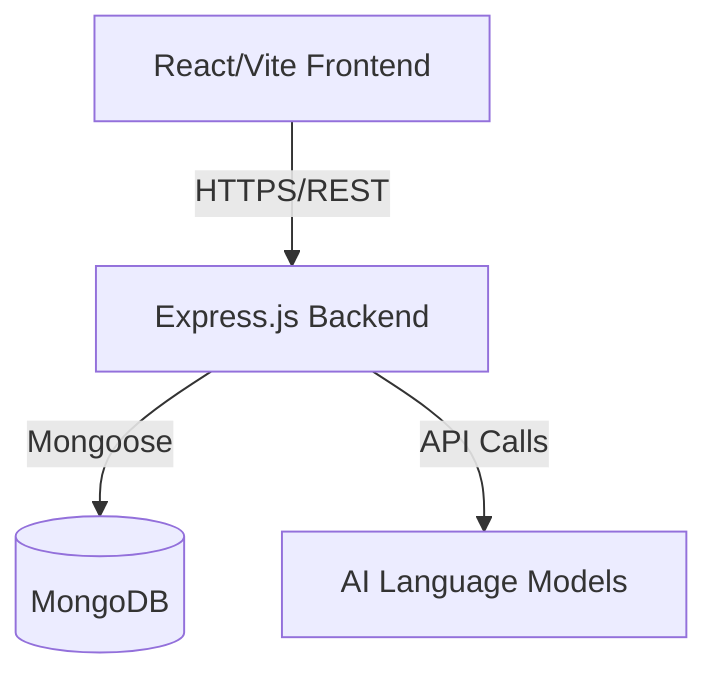

# NowScripts: AI-Powered Personalized ServiceNow Ecosystem
**B.Tech Final Year Project Report**

---

## Preliminary Pages

### Abstract
NowScripts is a comprehensive, AI-powered EdTech and freelance ecosystem designed exclusively for the ServiceNow platform. As the demand for ServiceNow professionals accelerates globally, there exists a significant gap between traditional, fragmented learning resources and the practical, enterprise-grade skills required by the industry. NowScripts bridges this gap by unifying learning, practice, project building, certification preparation, and interview readiness into a single, cohesive platform. By integrating advanced Artificial Intelligence systems—including a Platform Copilot, an AI Learning Assistant, and a voice-enabled AI Interview Simulator—the platform provides a highly personalized learning trajectory. Developed using the MERN stack (MongoDB, Express.js, React, Node.js), NowScripts delivers a premium SaaS user experience with scalable architecture, empowering students, career switchers, and IT professionals to transition seamlessly from beginners to certified experts and freelancers.

### Acknowledgement
*(To be filled by the author acknowledging project guides, mentors, and contributors like Md Afan Khan for scenario questions.)*

---

## Chapter 1 – Introduction

### 1.1 Introduction
The rapid digital transformation of modern enterprises has positioned ServiceNow as a critical platform for IT Service Management (ITSM), HR Service Delivery (HRSD), and custom enterprise applications. Consequently, the demand for certified ServiceNow administrators and developers has surged. NowScripts is conceptualized to address the educational and professional requirements of individuals aiming to enter this ecosystem.

### 1.2 Background
Historically, learning ServiceNow required piecing together disparate resources: official documentation, expensive third-party courses, and disconnected community forums. There was no single platform that guided a user from fundamental concepts through practical application to interview readiness. 

### 1.3 Problem Statement
Aspiring ServiceNow professionals lack a unified platform that offers structured learning, practical coding scenarios, AI-driven mentorship, and realistic interview simulations. Existing platforms are generic and do not cater to the specific architectural and developmental nuances of the ServiceNow ecosystem.

### 1.4 Existing System
Current solutions involve generic Learning Management Systems (LMS) like Udemy or Coursera, combined with ServiceNow's official Developer Portal. 

### 1.5 Limitations of Existing System
- Fragmented learning experience.
- Lack of personalized, domain-specific AI assistance.
- Absence of realistic, voice-based interview simulators tailored to ServiceNow scenarios.
- No integrated progression from learning to freelancing.

### 1.6 Proposed System
NowScripts proposes a vertically integrated ecosystem exclusively for ServiceNow. It combines structured roadmaps, interactive coding exercises, extensive certification question banks (CSA/CAD), and three distinct AI systems to mentor users.

### 1.7 Objectives
- To build a robust MERN-stack platform providing end-to-end ServiceNow education.
- To implement AI-driven personalized learning and interview simulation.
- To provide industry-standard sprint projects for practical experience.

### 1.8 Scope
The Phase 1 scope covers the core learning platform, user authentication, progress tracking, community integration, CSA/CAD preparation modules, and the foundation of the AI Copilot and Learning Assistant.

### 1.9 Motivation
The motivation stems from the founder's vision (Kanam Ramu) to democratize high-quality, enterprise-grade ServiceNow education and create a seamless bridge between academic learning and industry employment.

### 1.10 Contributions
- Designed a premium SaaS architecture.
- Developed an extensive database of 1000+ certification questions and 71+ pages of real-time scenarios.
- Integrated LLM-based AI assistants specifically prompt-engineered for ServiceNow development.

---

## Chapter 2 – Literature Survey

### 2.1 ServiceNow Learning Platforms
A review of existing platforms reveals that while ServiceNow's Now Learning provides authoritative content, it lacks the personalized pacing and AI-driven debugging assistance that beginners require.

### 2.2 Learning Management Systems
Traditional LMS platforms deliver video-based content but fail to provide interactive, scenario-based evaluations necessary for mastering enterprise software like ServiceNow.

### 2.3 AI-powered Learning Systems
Recent advancements in Large Language Models (LLMs) have enabled personalized tutoring. However, generic LLMs often hallucinate ServiceNow-specific APIs (like GlideRecord or GlideAjax) without strict, domain-specific prompt engineering.

### 2.4 Research Gap
There is a distinct lack of domain-specific, AI-driven educational platforms for enterprise SaaS software that actively simulate real-world project sprints and interviews.

### 2.5 Comparative Analysis
Unlike competitors, NowScripts integrates the learning material directly with AI debugging, certification practice, and a specialized community, providing a superior UX/UI.

---

## Chapter 3 – Requirement Analysis

### 3.1 Functional Requirements
- Secure user registration, login, and profile management.
- Dynamic rendering of learning roadmaps and course modules.
- Interactive quiz system for CSA and CAD certification preparation.
- AI chat interface for the NowScripts Copilot and Learning Assistant.
- Community discussion boards and project showcases.

### 3.2 Non-functional Requirements
- **Performance**: Page load times under 2 seconds.
- **Scalability**: Capable of handling thousands of concurrent users.
- **Security**: JWT-based authentication and secure API endpoints.
- **Usability**: Premium, responsive, and accessible UI adhering to modern design principles.

### 3.3 Software Requirements
- **Frontend**: React (Vite), Tailwind CSS, TypeScript.
- **Backend**: Node.js, Express.js.
- **Database**: MongoDB.
- **AI**: OpenAI API / Custom LLM integration.

### 3.4 Hardware Requirements
- **Server**: Cloud hosting (e.g., AWS, Render) with at least 2GB RAM for Node.js backend.
- **Client**: Any modern web browser.

### 3.5 User Roles
- **Student/Learner**: Accesses courses, tracks progress, takes mock tests.
- **Admin**: Manages courses, questions, users, and platform analytics.

---

## Chapter 4 – System Analysis & Design

### 4.1 Overall Architecture
NowScripts utilizes a decoupled client-server architecture. The React single-page application (SPA) communicates via RESTful APIs with the Node.js/Express backend, which interfaces with a MongoDB NoSQL database.

### 4.2 High-Level Architecture

### 4.3 Low-Level Architecture
State management is handled via React Context and Hooks. Components are modularized (e.g., `<LearnDashboard />`, `<InterviewPrep />`). The backend uses layered routing (Controllers, Services, Models).

### 4.4 Data Flow Diagram
User Input -> React State -> Axios Request -> Express Router -> Controller Logic -> MongoDB -> JSON Response -> UI Update.

---

## Chapter 5 – Database Design

### 5.1 Schema Design (MongoDB)
Since MongoDB is schema-less, Mongoose is used to enforce data integrity.

**Users Collection**
- `_id`, `name`, `email`, `password_hash`, `role`, `progress_metrics`, `badges`.

**Courses Collection**
- `_id`, `title`, `description`, `modules` (Array), `difficulty`.

**Questions Collection (QuestionBank)**
- `_id`, `category` (CSA/CAD/Scenario), `question_text`, `options`, `correct_options`, `explanation`.

### 5.2 Relationships
- A User has many Course Progress records (1:N).
- A Course has many Modules (1:N).

---

## Chapter 6 – Module Design

### 6.1 Authentication Module
Implements secure JWT-based login/signup, password hashing with bcrypt, and protected route wrappers in React.

### 6.2 User Dashboard
Displays learning progress, earned certifications, skill badges, and analytics using dynamic charting libraries.

### 6.3 Learning Module & Roadmaps
Renders structured content parsed from JSON/Markdown, categorized into Administration, Development, and Architecture.

### 6.4 Practice Module (CSA, CAD, Scenarios)
A robust evaluation engine that randomly serves questions, tracks scores, and provides detailed explanations upon answer submission. Features real-world scenarios credited to industry experts (e.g., Md Afan Khan).

### 6.5 Projects Module
Provides sprint-based project outlines simulating agile enterprise development environments.

---

## Chapter 7 – AI Features

### 7.1 NowScripts Copilot (Platform Assistant)
An embedded AI trained specifically on the platform's architecture to guide users through the UI and explain platform features.

### 7.2 AI Learning Assistant
A domain-specific AI engineered to answer technical ServiceNow questions, debug Business Rules, and explain Client Scripts. It is instructed to behave as a senior ServiceNow expert rather than a generic chatbot.

### 7.3 AI Interview Platform (Architecture for Phase 2)
Will utilize WebRTC for voice communication, integrating Speech-to-Text (STT) and Text-to-Speech (TTS) with the LLM to simulate a live interview, culminating in an automated scorecard.

---

## Chapter 8 – Implementation

### 8.1 Frontend
Developed using React 18, bootstrapped with Vite for optimal HMR. Tailwind CSS is used for utility-first styling to ensure a premium SaaS aesthetic.

### 8.2 Backend
Node.js with Express handles API requests. CORS is configured for secure cross-origin resource sharing.

### 8.3 Database & APIs
Mongoose models map to MongoDB collections. REST endpoints follow standard naming conventions (e.g., `GET /api/courses`, `POST /api/auth/login`).

---

## Chapter 9 – Testing

### 9.1 Unit & Integration Testing
Components were tested for rendering and state updates. Backend endpoints were tested using Postman to verify HTTP status codes and JSON payloads.

### 9.2 UI & Performance Testing
Lighthouse was used to ensure high performance, accessibility, and SEO (React Helmet Async implemented for dynamic meta tags).

---

## Chapter 10 – Results

The implementation of Phase 1 yielded a fully functional, high-performance platform. 
- **Learning Dashboard**: Successfully renders dynamic paths.
- **Interview Prep**: Effectively evaluates users across 1000+ questions and 71 pages of scenario data.
- **SEO**: Dynamic sitelinks and JSON-LD schema markup successfully generated.

---

## Chapter 11 – Future Scope

### Phase 2: AI Personalization & Interviews
Implementation of voice-based AI interviews and resume/LinkedIn analysis.

### Phase 3: ServiceNow PDI Integration
Direct API connections to user Personal Developer Instances (PDIs) to automatically verify lab completion and review code.

### Phase 4 & 5: AI Agent Ecosystem
Deployment of autonomous AI agents capable of assisting in live ServiceNow development environments.

---

## Chapter 12 – Conclusion
NowScripts successfully redefines the EdTech landscape for ServiceNow. By prioritizing a premium user experience, robust pedagogical structure, and cutting-edge AI integration, the platform effectively accelerates the journey from novice to employed professional. The modular architecture ensures the system is highly scalable and prepared for future phases of development.

---

## References
1. ServiceNow Official Product Documentation.
2. React.js and Vite Official Documentation.
3. Node.js and Express.js Architecture Guidelines.
4. Research on LLMs in Educational Technology (e.g., IEEE papers on AI tutoring).
5. Scenarios and Question Banks (Contributions by Md Afan Khan and community experts).
