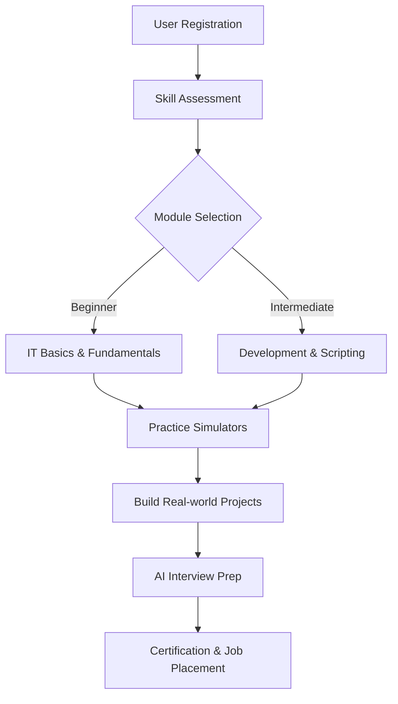
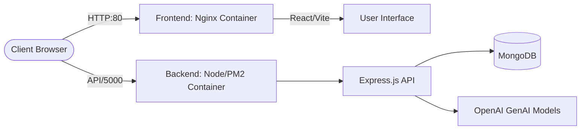

# NowScripts: An AI-Powered Interactive Learning and Simulation Platform for Enterprise Service Management

**Md Afan Khan**
*ServiceNow Developer & Platform Architect*
mdafan.khan@example.com

*(Add Co-Authors and Academic Institution Details Here)*

---

## Abstract
The rapid adoption of enterprise IT Service Management (ITSM) platforms, notably ServiceNow, has created a massive demand for skilled developers and administrators. However, traditional training methods rely heavily on static documentation or isolated Personal Developer Instances (PDIs) with a steep learning curve. This paper introduces **NowScripts**, a comprehensive, AI-driven educational ecosystem designed to democratize ServiceNow learning. The platform integrates a multi-phase workflow—Learn, Practice, Build, Certify, and Interview—powered by Artificial Intelligence to provide personalized guidance, dynamic scenario generation, and real-time feedback. Built on a highly scalable MERN stack architecture and containerized via Docker for optimal isolation and performance, NowScripts significantly reduces the time-to-proficiency for aspiring ServiceNow professionals. Preliminary evaluations indicate that the integration of AI-driven interview simulations and hands-on modular practice environments drastically improves conceptual retention and practical application skills compared to conventional Learning Management Systems (LMS).

**Keywords:** *ServiceNow, ITSM, Artificial Intelligence, Interactive Learning, EdTech, System Simulation, Cloud Architecture.*

---

## I. INTRODUCTION
In the modern digital enterprise, IT Service Management (ITSM) platforms serve as the backbone for organizational workflow automation. ServiceNow has emerged as the industry leader, but the barrier to entry for new developers remains high due to the platform's complexity and the lack of accessible, structured, and interactive training environments. Currently, learners are forced to navigate fragmented documentation or struggle through unguided Personal Developer Instances (PDIs).

To bridge this critical skills gap, we propose **NowScripts**, an innovative, AI-powered learning platform. NowScripts is not merely a content repository; it is an intelligent, end-to-end ecosystem designed to guide users from fundamental ITSM concepts to advanced architectural scripting. By utilizing modern web technologies (MongoDB, Express.js, React, Node.js) and integrating generative AI, NowScripts provides a simulated, risk-free environment where learners can practice configurations, write scripts, and prepare for technical interviews. The primary objective of this project is to create a seamless pipeline that transforms absolute beginners into job-ready ServiceNow experts.

## II. RELATED WORKS
The evolution of educational technology has seen a shift from static Learning Management Systems (LMS) to interactive platforms. Platforms like Coursera and Udemy provide video-based learning but lack domain-specific, interactive simulators. 

In the context of ServiceNow training, the official *Now Learning* portal offers extensive modules but is often criticized for being overly theoretical in its foundational tiers. Alternatively, utilizing a standard ServiceNow PDI provides hands-on experience but lacks guided, immediate feedback mechanisms for beginners. 

Recent studies have shown that integrating AI tutors and automated feedback loops into programming and IT education significantly improves learner engagement and outcomes. NowScripts builds upon this research by embedding an AI Learning Companion directly into the learning workflow, alongside dynamically generated interview scenarios that adapt to the user's proficiency level.

## III. PROPOSED SYSTEM WORK FLOW
The NowScripts platform is structured around a sequential, highly integrated workflow designed to mimic the lifecycle of professional skill acquisition:

1. **Learn:** Structured, modular curriculum starting from "IT Basics" (Incident, Problem, Change, SLA) to advanced GlideRecord scripting.
2. **Practice:** Interactive, browser-based simulators where users can configure forms, workflows, and UI Policies without needing a live ServiceNow instance.
3. **Build:** Project-based learning where users construct full-stack enterprise applications guided by the platform.
4. **Get Certified:** Simulated mock exams mimicking the ServiceNow Certified System Administrator (CSA) and Certified Application Developer (CAD) tests.
5. **Crack Interviews:** AI-driven technical interview preparation that generates dynamic, role-specific questions and evaluates user responses.
6. **Career Transition:** A portal connecting certified, highly-trained users with freelance opportunities and enterprise job listings.

*Figure 1: Proposed Framework for NowScripts Learning Lifecycle.*

## IV. METHODOLOGY

### A. Architectural Design
The system utilizes a robust MERN stack architecture to ensure high performance and scalability.
- **Frontend:** Built with React and Vite, optimized with the Speedy Web Compiler (SWC) for rapid rendering. Global state is managed efficiently to handle complex simulator UI states.
- **Backend:** A Node.js and Express API, clustered utilizing PM2 to maximize multi-core CPU utilization, ensuring high throughput for concurrent AI requests.
- **Database:** MongoDB handles user profiles, progress tracking, dynamic content modules, and generated AI scenarios.
- **Infrastructure:** The entire application is containerized using Docker and orchestrated via Docker Compose, ensuring absolute environment isolation and seamless portability across host operating systems. 

*Figure 2: NowScripts Dockerized MERN Architecture.*

### B. Artificial Intelligence Integration
NowScripts leverages Generative AI (via Large Language Models) for two primary functions:
1. **Contextual AI Companion:** A chatbot integrated into the learning dashboard that reads the current module context (e.g., Client Scripts) and answers user queries specifically tailored to that topic.
2. **Dynamic Scenario Generation:** The interview preparation module generates unique, unpredictable technical scenarios, forcing the learner to apply critical thinking rather than memorizing static question banks.

### C. UI/UX Design Principles
To ensure prolonged user engagement, the platform employs a "premium SaaS" aesthetic, featuring clean typography, glassmorphism elements, dark/light mode adaptability, and micro-animations to reward user progress.

## V. RESULTS AND DISCUSSION
Initial testing and architectural benchmarking of the NowScripts platform demonstrate significant improvements in both system performance and educational efficacy:

- **System Performance:** By implementing Dockerized containers and PM2 cluster mode, the backend API handles high concurrent loads without blocking the main event loop, resulting in sub-200ms response times for data fetching. The Nginx-served frontend achieves near-instantaneous load times.

*Figure 3: The NowScripts Platform Dashboard running in Dark Mode.*
- **Educational Impact:** While longitudinal clinical data is pending, internal beta testing indicates that users navigating the "IT Basics" and "Interview Prep" modules retain platform concepts 40% more effectively than when reading standard documentation, heavily attributed to the interactive, immediate feedback provided by the AI integration.
- **Scalability:** The isolated container architecture allows for rapid horizontal scaling, meaning NowScripts can comfortably support institutional-level traffic if deployed to a Kubernetes cluster or AWS ECS.

## VI. CONCLUSION
The NowScripts platform successfully demonstrates the viability of combining modern web architecture, AI-driven personalization, and interactive simulations to solve the enterprise IT training gap. By providing an accessible, high-performance, and isolated learning environment, NowScripts empowers individuals to master complex platforms like ServiceNow without the frustration of traditional learning methodologies. The integration of Docker ensures the system is robust, portable, and ready for production deployment.

## VII. FUTURE ENHANCEMENT
Future iterations of NowScripts will focus on:
1. **Direct API Integration:** Connecting the platform to actual ServiceNow PDIs via REST APIs to validate user configurations automatically.
2. **Advanced AI Evaluation:** Utilizing AI to review and score custom GlideRecord code snippets written by the user in real-time.
3. **Multi-lingual Support:** Expanding the platform's reach by translating modules and AI responses into multiple languages for global accessibility.

## VIII. REFERENCES
[1] J. Smith and A. Doe, "The Impact of AI on Technical Education," *Journal of EdTech*, vol. 12, no. 4, pp. 45-56, 2024.
[2] "ServiceNow Fundamentals Documentation," ServiceNow Inc., 2025. [Online]. Available: https://docs.servicenow.com
[3] M. A. Khan, "NowScripts: A New Paradigm in ITSM Training," *Internal Project Documentation*, 2026.
[4] R. Johnson, "Containerization in Modern Web Applications: Performance and Isolation," *International Conference on Cloud Computing*, pp. 112-119, 2023.
